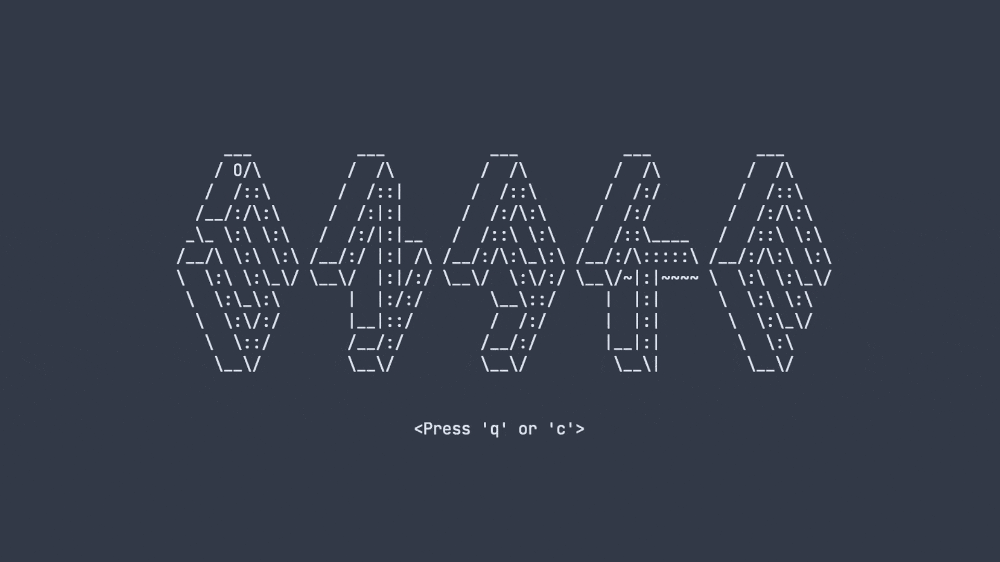

<center> <h1>🐍 Snake Labyrinth 🐍</h1> </center>



## Prerequisite

> NOTE:  
> The application is mainly been tested on UNIX systems and WSL. It may run on Windows but wasn't tested.

* gcc (compatible with C99)
* Ncurses

We give a script to easly install ncurses on most systems. Just run `make ncurses`

## Usage

```sh
make && ./build/maze
```
